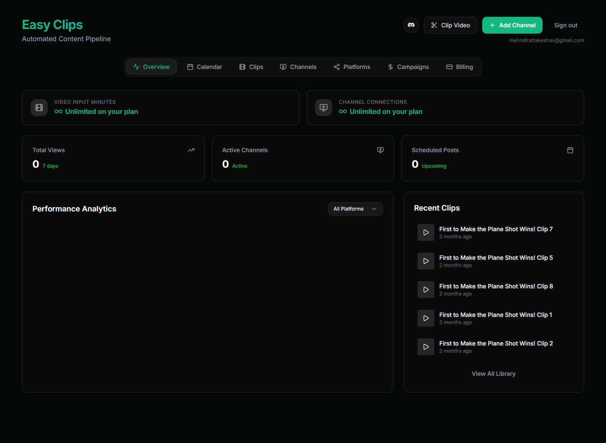
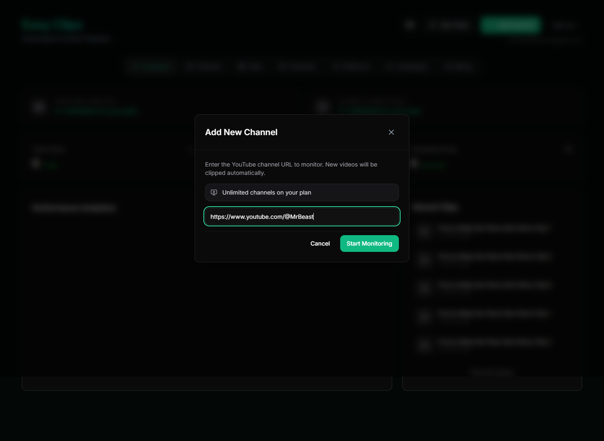
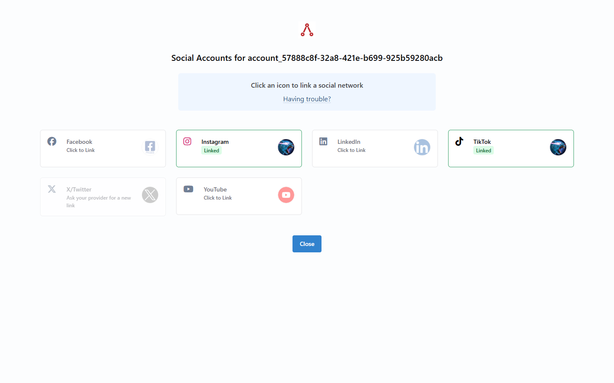
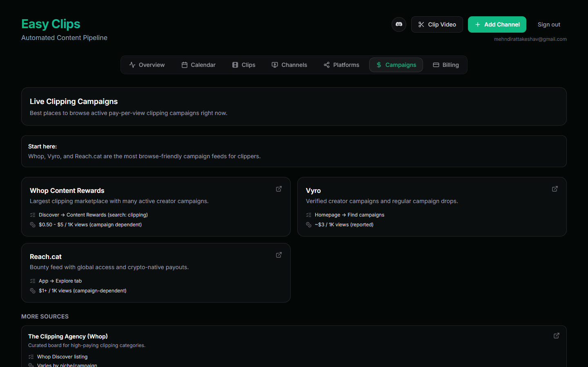
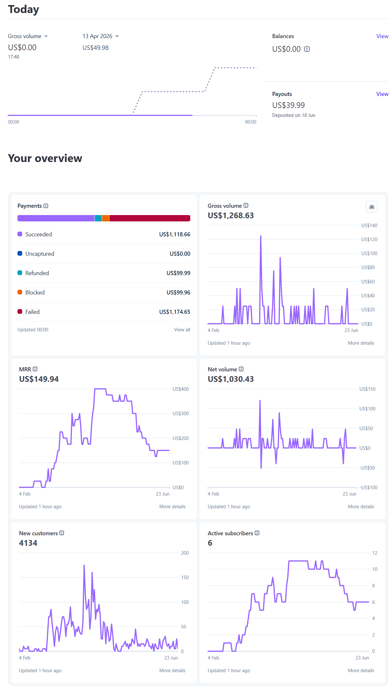

# EasyClips

**AI-powered short-form video automation platform**

[easyclips.io](https://easyclips.io)

Turn any YouTube channel into a stream of viral-ready clips — automatically edited, captioned, and published across TikTok, Instagram Reels, YouTube Shorts, and LinkedIn.

---

## What It Does

EasyClips scans YouTube channels, uses AI to identify the most shareable moments, crops them to vertical format, adds captions, and distributes finished clips on a schedule — 100% passively.

### The 3-Step Flow

1. **Paste a YouTube channel URL** — connect any channel
2. **AI extracts & edits** — identifies viral moments, crops vertically, adds captions, renders
3. **Auto-publish** — clips go live across all platforms on schedule

---

## Key Features

| Feature | Description |
|---------|-------------|
| Smart Moment Detection | AI identifies the most engaging, shareable segments from long-form content |
| Vertical Crop & Reframe | Automatically reformats landscape video for short-form platforms |
| Auto Captions | Generates and overlays accurate captions — no manual editing |
| Multi-Platform Publishing | Simultaneous distribution to TikTok, Reels, Shorts, and LinkedIn |
| Scheduled Posting | Set it and forget it — clips publish on your timeline |
| New Upload Monitoring | Automatically processes new videos as they're uploaded |

---

## Who It's For

- **Podcasters** — turn long episodes into shareable highlights
- **Educators** — repurpose lectures into bite-sized lessons
- **Businesses** — convert webinars and demos into lead-generating content
- **Creators who are too busy to clip**

---

## Tech Stack

| Layer | Technology |
|-------|-----------|
| Frontend | Next.js, React, TailwindCSS |
| Backend | Node.js |
| AI & Video Processing | [Motion](https://www.motion.ai) API (YC-backed) |
| Distribution | [Ayrshare](https://www.ayrshare.com) API |

---

## Screenshots

### Landing Page


### Dashboard Overview


### Clip Video — AI-Powered Generation


### Add Channel — Connect Any YouTube Channel


### Content Library


### Posting Schedule Calendar


### Multi-Platform Distribution


### Social Account Connections (via Ayrshare)


### Campaign Management


### Pricing Plans


### Stripe Dashboard — Revenue & Metrics


---

## Architecture Overview

```
YouTube Channel URL
        │
        ▼
┌─────────────────┐
│  Channel Scanner │ ── monitors for new uploads
└────────┬────────┘
         │
         ▼
┌─────────────────┐
│ Moment Detection │ ── AI identifies viral-worthy segments
└────────┬────────┘
         │
         ▼
┌─────────────────┐
│  Video Pipeline  │ ── crop, caption, render
└────────┬────────┘
         │
         ▼
┌─────────────────┐
│  Auto Publisher  │ ── scheduled multi-platform distribution
└─────────────────┘
```

---

## Traction & Metrics (First 3 Months)

This was my first time building and launching a SaaS product. Everything below was achieved within **3 months** of launch:

| Metric | USD | CAD (approx.) |
|--------|-----|---------------|
| Gross Volume | $1,268.63 | $1,804 |
| Monthly Recurring Revenue (MRR) | $149.94 | ~$213 |
| Net Volume | $1,030.43 | ~$1,463 |
| Total Customers | 4,134 | — |
| Total Paying Customers | 28 | — |

### Stripe Dashboard


---

## About This Project

I built EasyClips from scratch as a solo founder — handling product design, full-stack engineering, and marketing. This is my first startup and my first SaaS product.

**Timeline:** Went from idea to revenue-generating product in 3 months.

**What I built:**
- Full-stack web application with auth, billing, and dashboards
- Integration with Motion's API for AI-powered clip generation and video processing
- Integration with Ayrshare for multi-platform distribution (TikTok, Instagram, YouTube, LinkedIn, Facebook)
- Subscription billing with Stripe integration
- Channel monitoring system that auto-clips new uploads

---

## Contact

Built by [Keshav Mehndiratta](https://github.com/KeshavM05)

- Website: [easyclips.io](https://easyclips.io)
- Email: mehndirattakeshav@gmail.com
